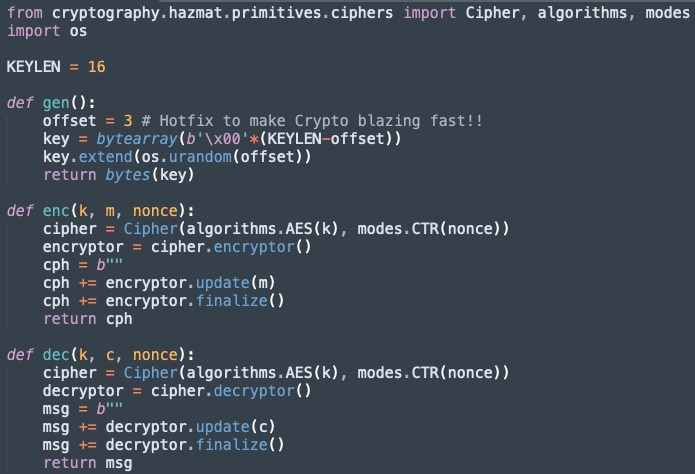
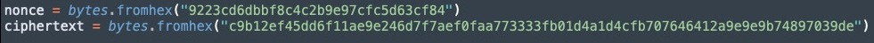
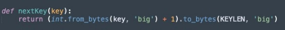
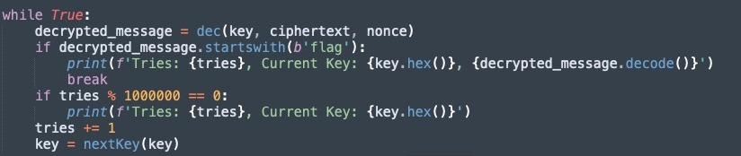
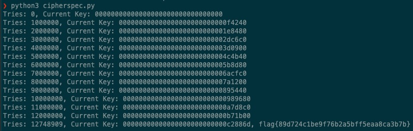

# CTF WEEK 10 - Weak Encryption

Objective: Exploit an insecure key generation to decrypt a ciphertext without having access to the symmetric key used in its creation.

This week's CTF challenge involves applying the theoretical concepts learned in cryptography classes, specifically focusing on the key space. In modern cryptography, the security of a cipher is closely tied to the difficulty an attacker faces in guessing the key. If the search space is small enough to allow a brute-force attack, the scheme may become insecure.

In other words, the challenge requires participants to understand and exploit vulnerabilities related to key generation in order to decrypt a ciphertext, emphasizing the importance of a sufficiently large key space in ensuring cryptographic security.

A term **`ciphersuite`** refers to a specific set of algorithms that defines the security of data transmissions in communication networks, in this case, encrypting and decrypting a message.

After the donwload of the file and the code analysis:

The ciphersuite consists of three main functions:

**gen()**: Generates a key. Initially, this key has the first 13 bytes set to 0, and the remaining bytes are filled with random values using the os.urandom function.

**enc(k, m, nonce)**: Utilizes the AES-CTR algorithm to encrypt the message "m" with a key "k" previously generated by the "gen" function. The "nonce" parameter is a number used only once.

**dec(k, c, nonce)**: Decrypts the encrypted message "c" using the key "k" and the same "nonce" used in the encryption operation. Returns the original message in bytes.

It is evident that due to the insecure implementation of the first function, the key is vulnerable to a brute-force attack. Thus, with the use of brute force, only 16,777,216 (2^24) combinations would be required.

To find the encrypted message, we had to use the command "nc ctf-fsi.fe.up.pt 6003" and obtained the nonce and ciphertext. 

With this information, we began modifying the code to reach the final flag.

We created a function nextKey that increments by 1 until it discovers the key. This function also ensures that the key starts with 13 zeros, as requested.

Finally, the loop will run until it finds the flag. After some tries, we get the flag.

After some tries, finally we find the flag:

**flag{89d724c1be9f76b2a5bff5eaa8ca3b7b}**

