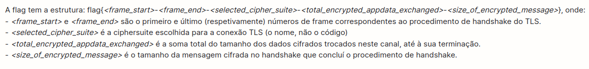
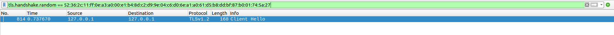
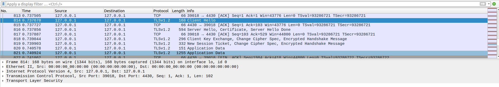
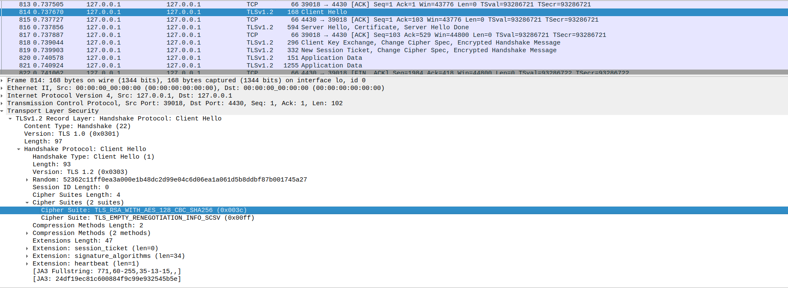
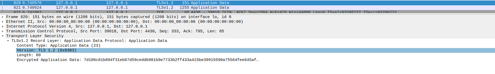
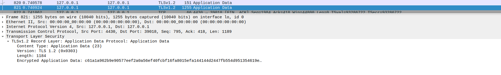

# CTF WEEK 13 - Find-my-TLS

To accomplish this week's challenge, we were provided with a file named "dump.pcapng" containing a large number of TLS connections. In order to solve this challenge, it is necessary to discover a flag that is constructed from various details of a specific connection. This connection uses the number `52362c11ff0ea3a000e1b48dc2d99e04c6d06ea1a061d5b8ddbf87b001745a27` in the Client Hello message of the handshake.

# TLS

The TLS (Transport Layer Security) protocol is a security layer that enables secure communication between two entities, such as a client and a server. It is widely used in various applications, including HTTPS, SMTPS, and FTPS. In the context of HTTPS, for example, TLS is used to establish a secure connection between a web browser (client) and a web server. This security is essential to ensure the confidentiality and integrity of transmitted data, protecting sensitive information against unauthorized interception and manipulation. In summary, TLS plays a crucial role in creating secure communication channels on the internet.

# Resolution

Firstly, we open Wireshark and begin analyzing the provided file. We apply the filter `tls.handshake.random == 52:36:2c:11:ff:0e:a3:a0:00:e1:b4:8d:c2:d9:9e:04:c6:d0:6e:a1:a0:61:d5:b8:dd:bf:87:b0:01:74:5a:27` to filter only the connection that uses the provided number.

With the result obtained from the previous filtering, it was easy to analyze that the handshake begins at frame `814`. With knowledge of how the TLS protocol works, we conclude that the handshake ends when we receive a `New Session Ticket` from the system, indicating that it is ready to receive data. This message is sent in frame `819`.

To determine the value corresponding to the `<selected_cipher_suite>` in the flag, we had to analyze the TLS layer of frame `814` and look for the desired field. We obtained the value `TLS_RSA_WITH_AES_128_CBC_SHA256`:

Next, to determine the value of `<total_encrypted_appdata_exchanged>` (total encrypted app data exchanged), we simply observed the two `Application Data` frames and added the values in the `Length` field. We obtained the value: `1264`.

Finally, to determine the value of `<size_of_encrypted_message>` (size of the encrypted message), we checked the value in the `Length` field of frame 818 and obtained the value: `80`.

Thus, combining all the information, we arrived at the flag:
`flag{814-819-TLS_RSA_WITH_AES_128_CBC_SHA256-1264-80}`

