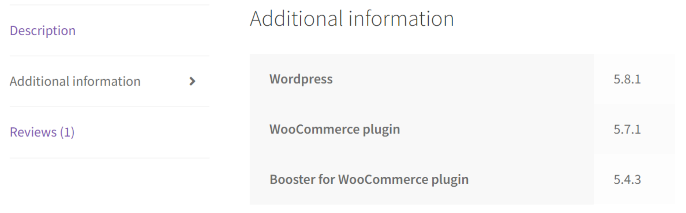
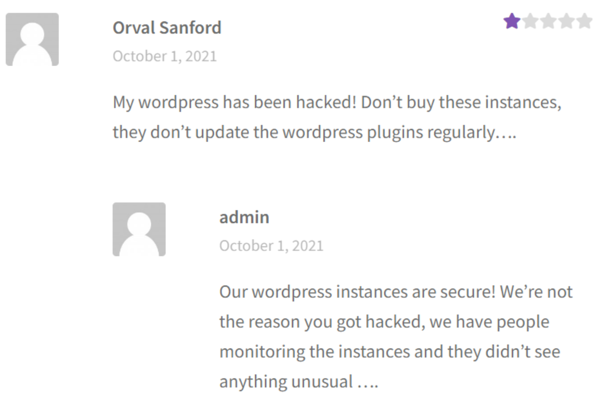
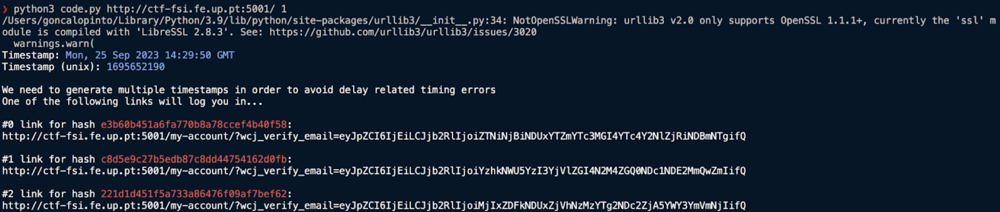
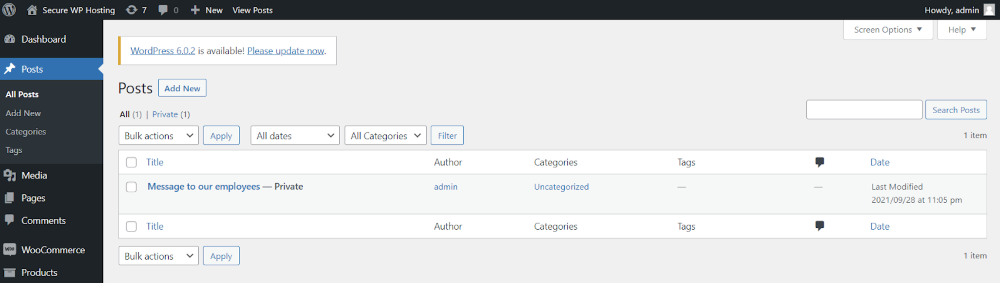
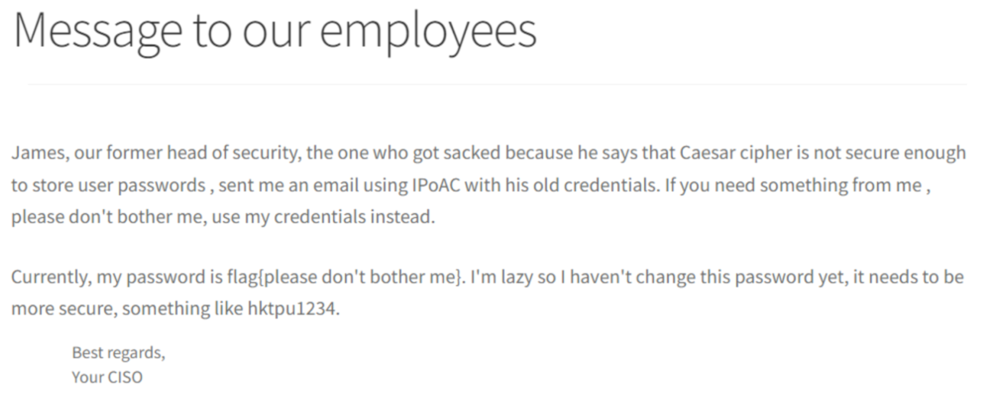

# Wordpress CVE - Challenge 1
First how main goal was to discover: 
- Wordpress version;
- Installed plugins and versions;
- Names of possible users.

After a couples minutes of exploring the website http://ctf-fsi.fe.up.pt:5001, we discovered this in a product on the shop section:

Then we searched for these 3 versions and found authentication bypass via the process_email_verification in the WordPress Plugin WooCommerce Booster Plugin 5.4.3. This allows attackers to impersonate users and trigger an email address verification for arbitrary accounts, including administrative accounts, and automatically be logged in as that user, including any site administrators.

FLAG: flag{CVE-2021-34646}

---

# Wordpress CVE - Challenge 2

After discovering the CVE we searched for an exploit and found this website https://www.exploit-db.com/exploits/50299, which allowed us to log in as an admin on the website https://ctf-fsi.fe.up.pt:5001/. 

First we run the script that we found and it returned 3 links:

that can be used to log in as an admin.

Secondly, now that we were logged in as an admin we opened the website http://ctf-fsi.fe.up.pt:5001/wp-admin/edit.php, where we found the private post that contained the flag we were looking for.

FLAG: flag{please don’t bother me}

