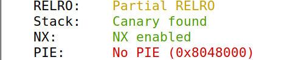
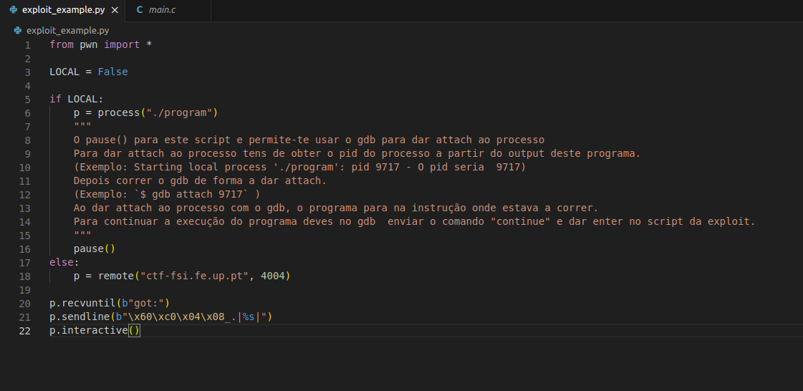
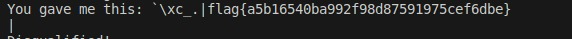
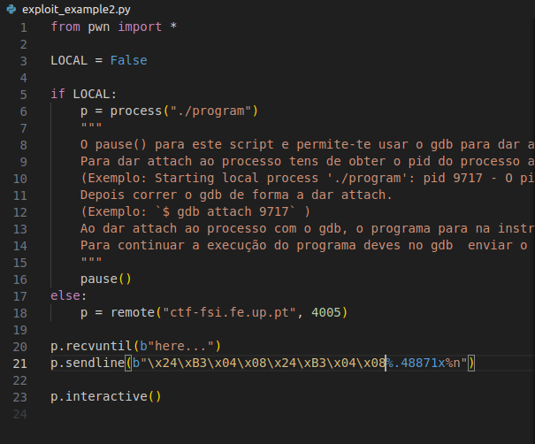
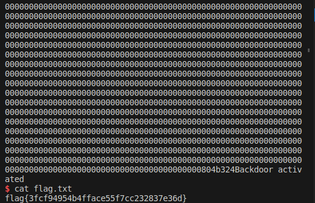

# CTFWEEK7
The goal for this week's challenges was to explore format string vulnerabilities and use them to manipulate a program's behavior in order to obtain the flags.

# Format Strings-Challenge 1:
Initially, we explored the files provided on the CTF platform, which are the same ones running on the server at port 4004.

Using the checksec command, we determined that the program (compiled main.c) does not have randomized binary, but it has protections for the return address using canaries.



- Q1: In which line of code is the vulnerability found?

- A1: The vulnerability can be found on line 25 when the 'scanf' function is called.

- Q2: What does the vulnerability allow us to do?

- A2: Format string vulnerabilities allow us to practically access and obtain information from any memory address in the program. In this challenge, it will enable us to jump to the memory address of the flag array and print out its contents.

- Q3: What's the functionality that enables us to obtain the flag?

- A3: With the use of format string placeholders, in this case, the '%s', that scans a character string.

After discovering the vulnerability, we need to find the address of the function to return the value from the buffer string. To do this, we used the gdb debugger:

```
$ gdb program
$ b main
$ run
$ p &flag 
```


The result was the return address "0x08049256," which is "\x60\xC0\x04\x08" in string format.

With all this information gathered, the final step involved using a Python script to create a character sequence to be sent to the program, resulting in the display of the flag's contents. The logic behind constructing this sequence is as follows: the first 4 bytes represent the memory address of the flag array, but in reverse order. Then, the placeholder %s is added, allowing the printing of the associated content.



After running the python exploit we received the following flag:



# Format Strings-Challenge 2 : 

OBS: Let's also change the port for the remote connection.

This challenge is pratically the same. When we run checksec we can see that there is the same restrictions from the first challenge.
This time, a bash is triggered if the value of 'key' is 0xBEEF, which is 48879 in decimal. This backdoor is sufficient to control the server and thereby query the contents of the flag.txt file.

- Q1: In which line of code is the vulnerability found? And what does it allow us to do?
- A1: The vulnerability can be found on line 25, it's the same vulnerability as in the first challenge. And it pretty much allows us to do the same thing.

- Q2: Is the flag loaded into memory? Or is there any functionality that enables us to access it?
- A2: In this program, the flag is not loaded into memory. Instead, a bash shell is opened if the condition `key == 0xbeef` is verified. And since `key` is a global variable, we can find out its memory address, and through the exploit access it and change its value to pass the condition. When such happens, and the bash shell opens, we can then call a bash command to read the and output the contents of the flag file.

- Q3: What must be done to unlock this functionality?
- A3: As mentioned in the previous answer, we must jump to the memory address of the `key` variable and change its value to `0xbeef`.


To modify the value of 'key', a global variable stored in the Heap, we employ a format string attack technique using the '%n' option in the input. Initially, it is necessary to obtain the value of the 'key' variable's address, for which we use gdb:


```
$ gdb program
$ b main
$ run
$ p &key 
```

Through scanf, we can manipulate the 'key' variable in the Heap using a '%n' format string attack. To address the issue of '%n' recording the number of characters written, we use '%.Ax' to specify the desired size. The formatted string becomes: address for '%x' + address for '%n' + '%.Ax' + '%n', taking into account the characters occupied by addresses when subtracting from 0xBEEF. Calculating 'A': With a total of 48879 characters needed for 0xBEEF, subtracting the 8 characters already written gives us 'A' as 48871.





After running our exploit, if successful, a simple "cat flag.txt" command will yield the desired flag.



