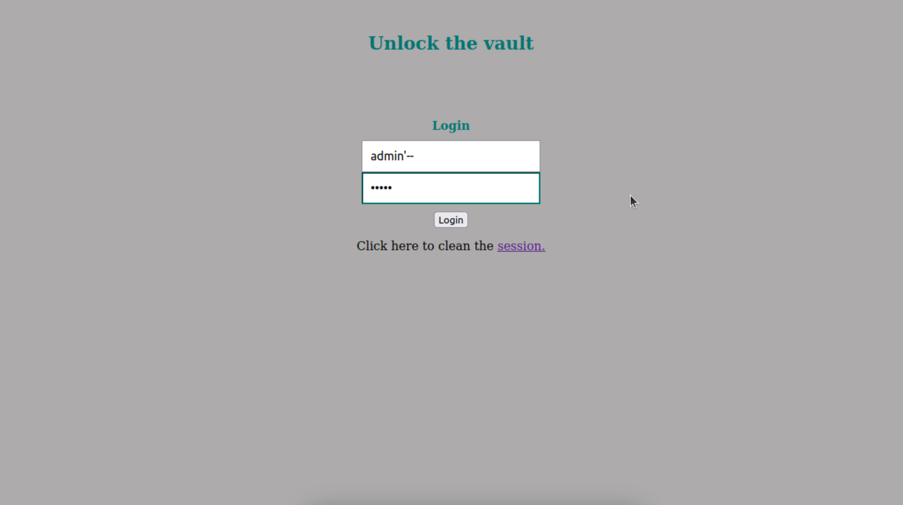
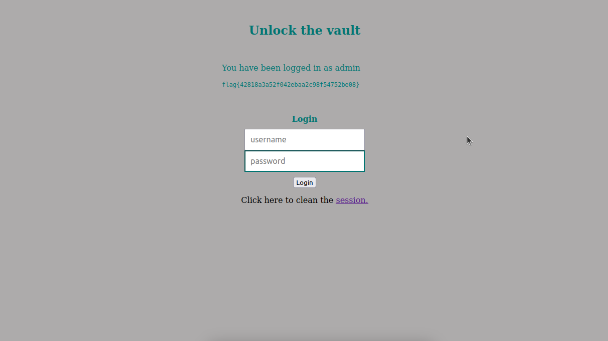

# CTF WEEK 8 - SQL Injection

Our first task is to investigate the PHP code and understand how SQL queries are formed from user input.

Following our initial exploration, our subsequent objective was to identify a vulnerability enabling us to bypass the login process without possessing account credentials. The vulnerability meeting these criteria was identified as a SQL injection. Exploiting such a vulnerability, if present in the source code, would allow us to achieve our goal of gaining unauthorized access to the admin account.

The logical progression involved a thorough analysis of the source code to pinpoint where a SQL injection vulnerability might exist. Our investigation led us to a specific line in the code that presented an exploitable opportunity — precisely, the query responsible for fetching user data from the server for login validation. This critical query is executed at line 40 in the source code.

`
$query = "SELECT username FROM user WHERE username = '".$username."' AND password = '".$password."'";
`

Upon identifying this potential weakness, we proceeded to examine the code in detail to understand the construction of the SQL query and how it interacts with user input. This analysis was crucial for devising a strategy to manipulate the input effectively, exploiting the vulnerability and achieving our goal of unauthorized access to the admin account.

For the purpose of this challenge, various SQL code snippets could be injected into the server by entering them into the username and/or password fields, ultimately leading to the retrieval of the flag. Our chosen approach was to inject the following SQL code into the username login field: `admin'--`. This specific code snippet serves the purpose of essentially truncating a part of the query by commenting it out.

To elaborate, by inputting this code into the username field and sending it to the server, the query replaces $username with the injected SQL code. This transformation modifies the query structure to:

`
$query = "SELECT username FROM user WHERE username = 'admin'--' AND password = '".$password."'";
`

The single quote (') we placed after 'admin' closes the search string, causing the characters -- to be interpreted as SQL code. In SQL, -- is used to comment a line, effectively rendering the query as follows:

`
$query = "SELECT username FROM user WHERE username = 'admin'";
`

The altered query now exclusively searches the database using a username, rendering the password irrelevant for login.

In the final step, we returned to the website and applied the aforementioned exploit. By entering admin'-- into the username field, we had to input something in the password field because it was a required field (even a space ' ' would suffice), although the password itself was not utilized for login validation. This manipulation allowed us to log into an account solely with knowledge of its username.

