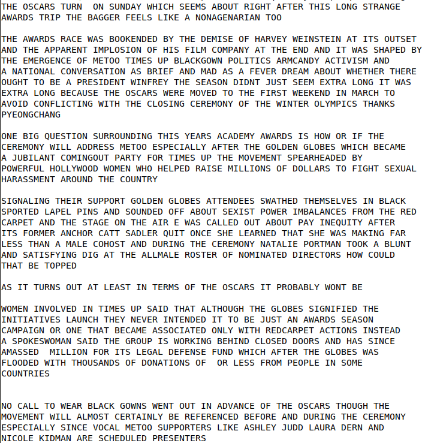
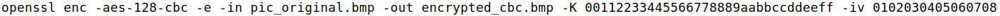

# Work from Week 10 - Secret-Key Encryption

## Task 1: Frequency Analysis
First, we analyzed the file that contained the frequencies, _freq.py_

Then we analyzed the most common trigrams in the English language, using the link provided in the sheet itself

Comparing the two pieces of information, we were able to map the first two trigrams

| Subtituition |
| ---------- |
| ytn => the |
| vup => and |

After that, we made the modifications below:

|Subtituition|
|----|
|x => o|
|mq => is|
|hr => rg|
|ibz => lfu|
|sdacg => kycmb|
|l => w|
|efok => pvjx|
|q => j|

In the end we had this text

## Task 2: Encryption using Different Ciphers and Modes

First, we create an file with this message:

The result of our messenger encryption was:

|Cipher|Encrypted|
|----|----|
|-aes-128-cbc||
|-bf-cbc||
|-aes-128-cfb||

## Task 3: Encryption Mode – ECB vs. CBC

### ECB

1) 
2) 
3) 

|original|final|
|----|----|
|||

### CBC

1) 
2) 
3) 

|original|final|
|----|----|
|||
