# Work from Week 11 - Public Key Infrastructures

##  Task 1: Becoming a Certificate Authority (CA)

The goal of this task is to establish ourselves as a root Certificate Authority (CA) without relying on commercial CAs. By becoming a root CA, we gain the ability to issue digital certificates, particularly for servers and other entities. Unlike regular certificates that are typically signed by higher-level CAs, the root CA's certificate is self-signed. This process involves generating a certificate for our root CA using tools like OpenSSL. The significance lies in the fact that root CA certificates are inherently trusted without conditions and are often pre-loaded into various software systems, ensuring the authenticity and security of digital communication. The task involves creating a robust foundation for managing digital certificates within a Public Key Infrastructure (PKI) framework.

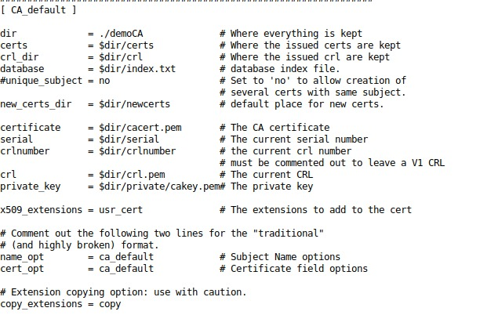

Now we can create the root certificate, using the following command, ensuring our identity as a CA.

`openssl req -x509 -newkey rsa:4096 -sha256 -days 3650 \
-keyout ca.key -out ca.crt \
-subj "/CN=www.modelCA.com/O=Model CA LTD./C=US" \
-passout pass:dees`

We can use the following commands to look at the decoded content of the X509 certificate and the RSA key.

`openssl x509 -in ca.crt -text -noout`

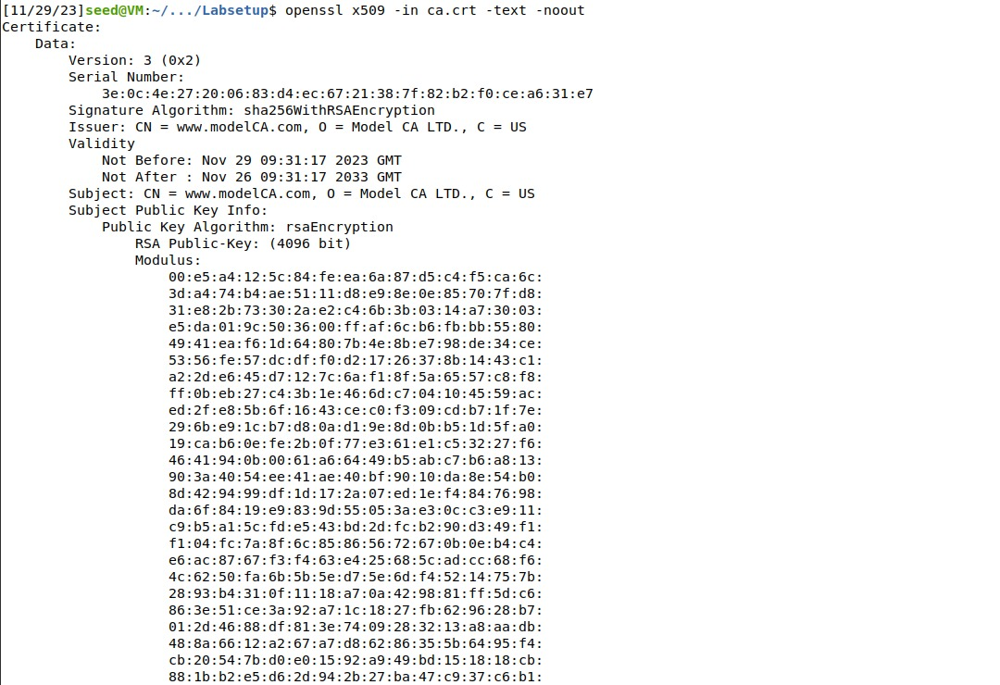
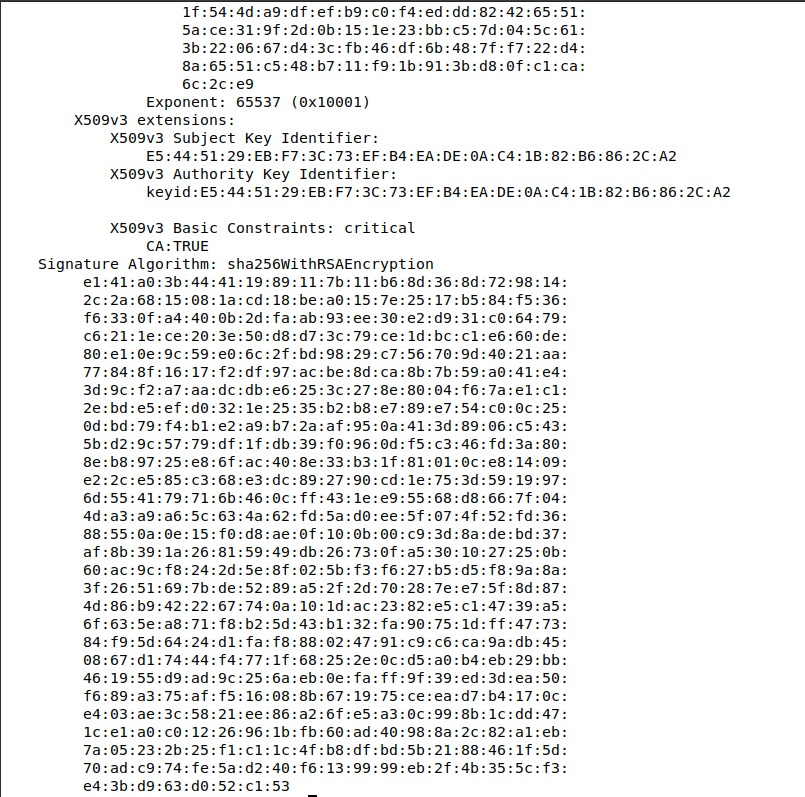

`openssl rsa -in ca.key -text -noout`

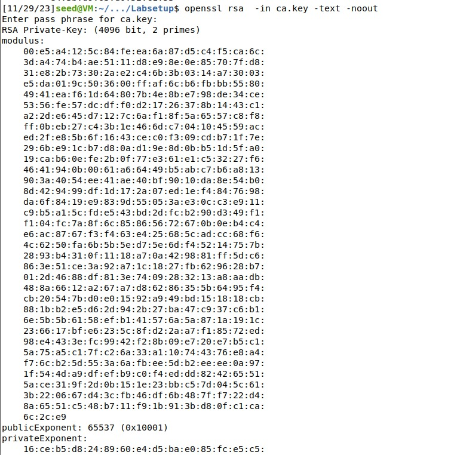

### Questions

1. What part of the certificate indicates this is a CA’s certificate?

    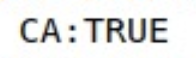

2. What part of the certificate indicates this is a self-signed certificate?

    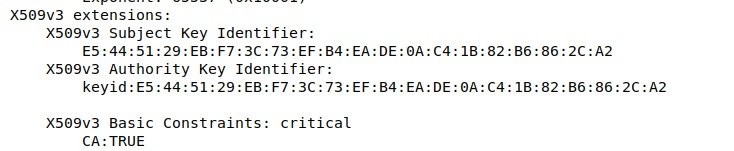

3. In the RSA algorithm, we have a public exponent e, a private exponent d, a modulus n, and two secret numbers p and q, such that n = pq. Please identify the values for these elements in your certificate and key files.

    Public exponent e

    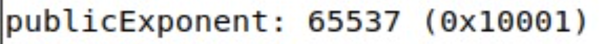

    Private Exponent d

    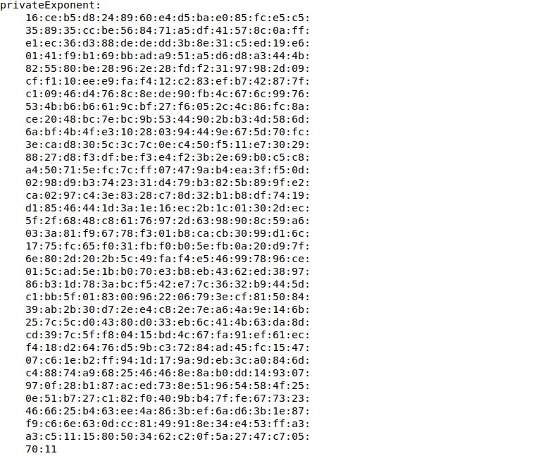

    Modulud n

    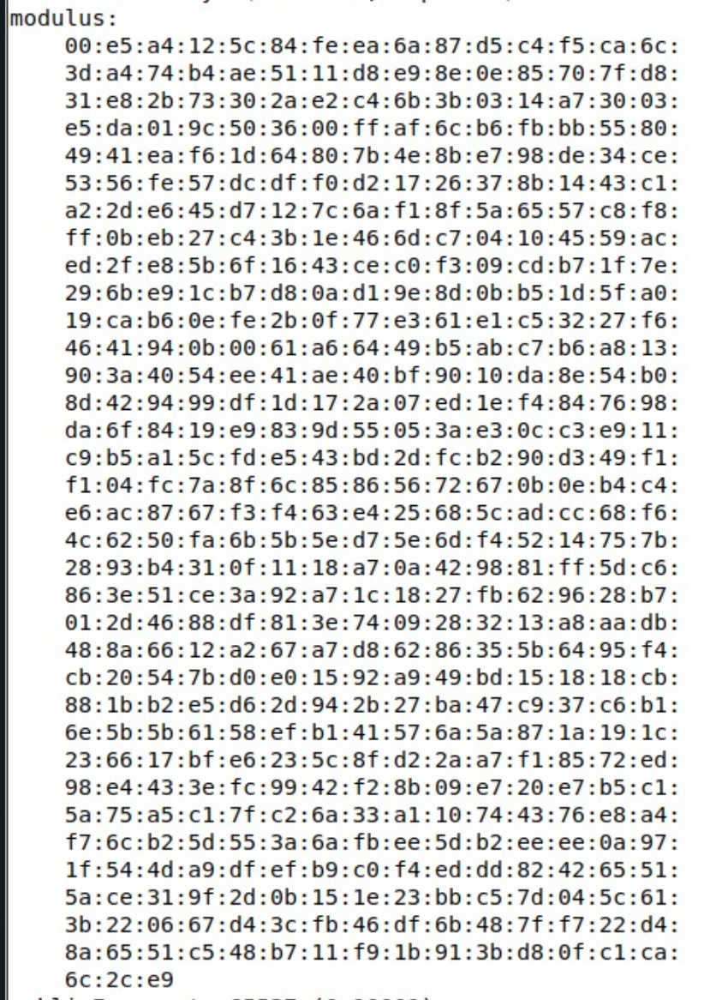

    Two secret numbers p and q
    
    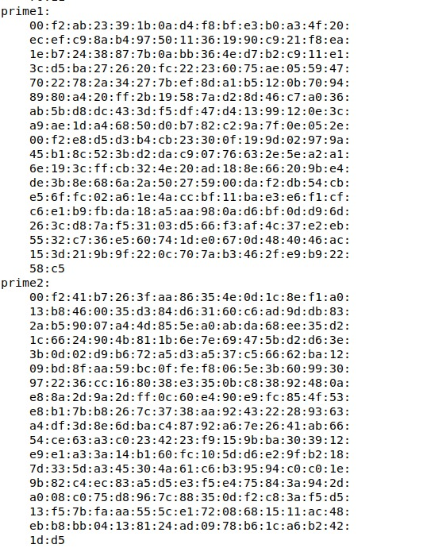

In conclusion, a Certificate Authority (CA) serves as a reliable entity responsible for issuing digital certificates that validate the association between a public key and its designated owner. The digital certificate essentially confirms the rightful ownership of a public key by the identified subject. It's crucial to note that the certificates issued by Root CAs enjoy unconditional trust, establishing a foundation for secure digital communication.

## Task 2: Generating a Certificate Request for Your Web Server

The goal of this task is to generate a Certificate Signing Request (CSR) for a web server (e.g., "bank32.com"). The CSR includes the server's public key and identity details. OpenSSL is used to create the CSR, specifying key size, hashing algorithm, and subject information. The task introduces Subject Alternative Names (SAN) to handle multiple server URLs, ensuring compatibility with browser policies. Two alternative names (e.g., "www.bank32A.com" and "www.bank32B.com") are added to the CSR to cover different hostnames associated with the web server. This step is crucial for obtaining a public key certificate from a Certificate Authority (CA).

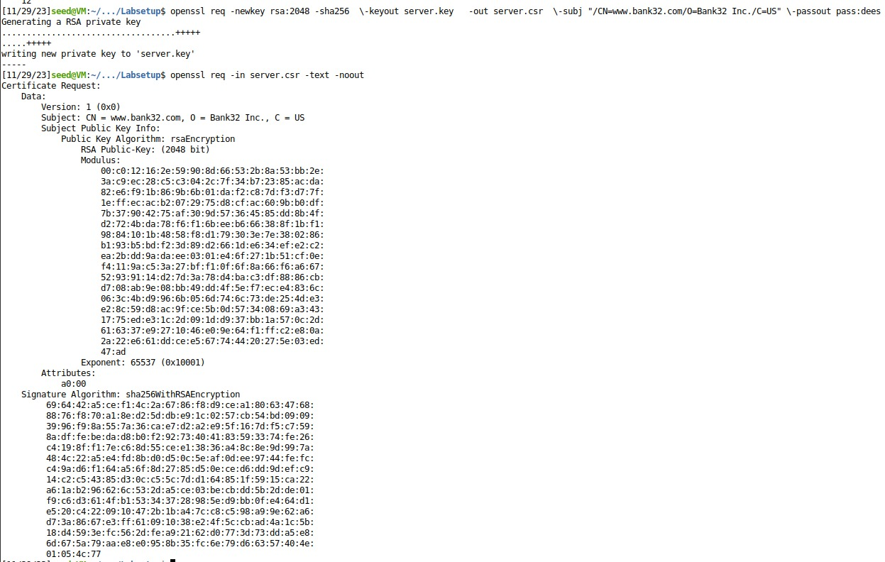

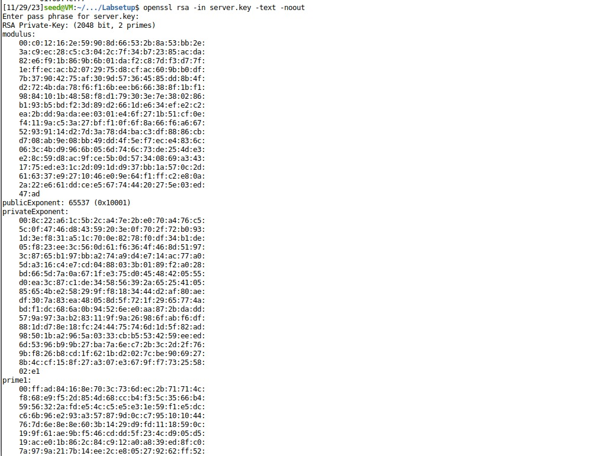

In conslusion, to get a trustworthy certificate, we need to generate a CSR and then send it to a CA.

## Task 3: Generating a Certificate for your server

The goal of this task is to generate a certificate for the web server using our self-established Certificate Authority (CA). Instead of sending the Certificate Signing Request (CSR) to an external CA, we use our CA's certificate and private key to sign the CSR and create the final X.509 certificate. The OpenSSL command, guided by the configuration file (myCA_openssl.cnf) and a lenient policy named "policy_anything," facilitates this process. An important step involves enabling the copying of the extension field from the CSR to the certificate for security reasons. After signing, the task directs us to verify the inclusion of alternative names in the certificate, ensuring compatibility with browser policies for multiple server URLs.

`# Extension copying option: use with caution.
copy_extensions = copy`

Our certificate signing command should look like this. 

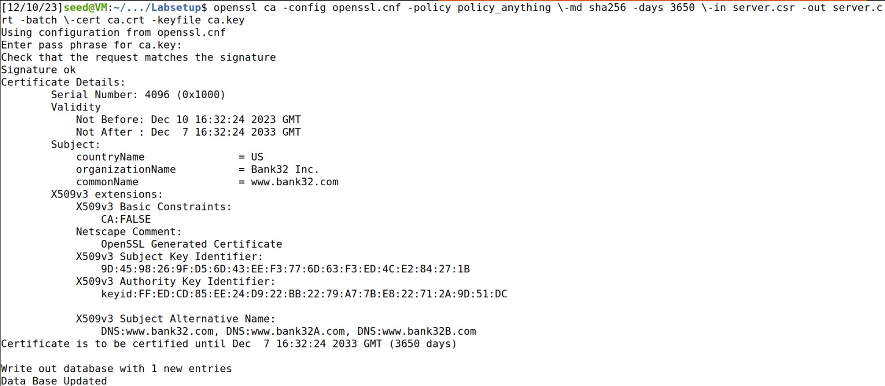

## Task 4: Deploying Certificate in an Apache-Based HTTPS Website

The goal of this task is to demonstrate the setup of an HTTPS website using the Apache server. This involves configuring Apache to use a specific virtual host for the HTTPS site and providing the necessary SSL/TLS certificates and keys. The example in the task focuses on a site for "www.bank32.com," but students are expected to adapt it for their own websites.

Via the VirtualHost file we can specify were the servers's certicate and private key are.

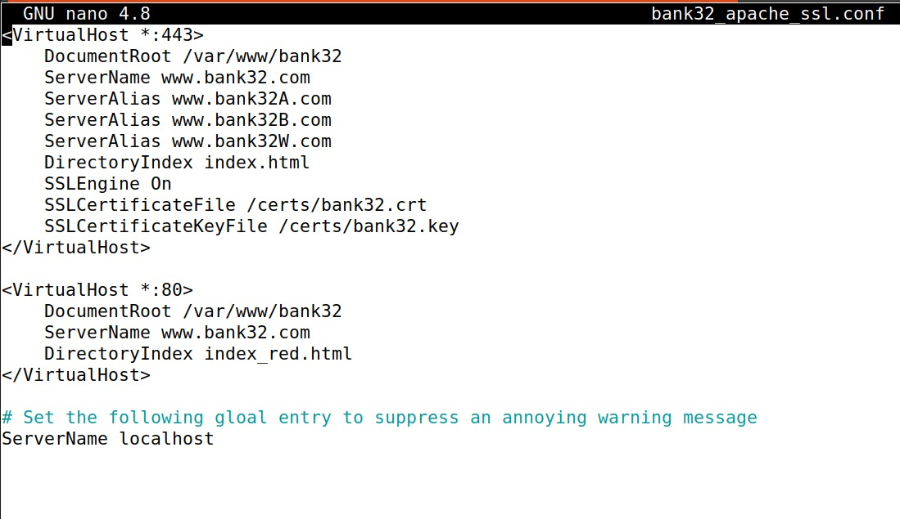

In order to make the website work, we need to enable Apache’s ssl module and then enable this site.

`a2enmod ssl // Enable the SSL module`

`a2ensite bank32_apache_ssl // Enable the sites described in this file`

Then we start the apache server with the following command.

`service apache2 start`

We can start browsing the website but the connection is not secure.

To make our connection secure, we added the CA certificate we generated to the authorities in the browser, at about:preferences#privacy -> Certificates -> View Certificates -> Authorities -> Import, and verified that the connection is now secure.

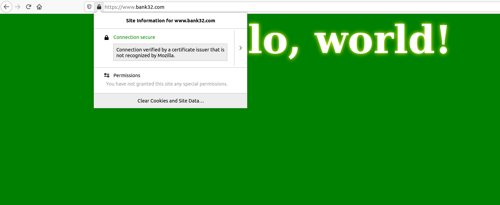

## Task 5: Launching a Man-In-The-Middle Attack

The goal of this task is to demonstrate and understand how Public Key Infrastructure (PKI) helps prevent Man-In-The-Middle (MITM) attacks, specifically those targeting HTTPS communication. The task aims to simulate a MITM attack scenario and illustrate how PKI mechanisms thwart such attacks.

First we start by reusing the same setup we did before, only difference is we change the name server in the virtualhost file to `www.example.com`.

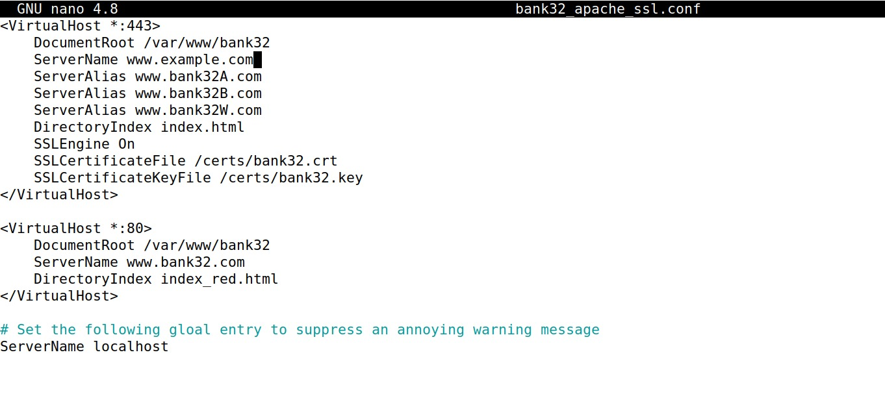

Then we changed the DNS of the victim, connecting the hostname `www.example.com` to the malicious webserver's IP.

`10.9.0.80 www.example.com`

Now when we open the site this appens:

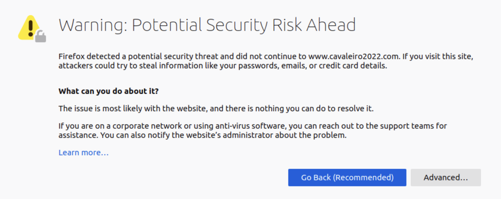

Conslusion: This is due to the inconsistency of the certificate used because the domain name does not match the one present in the server certificate. Therefore the website warns the user of a potential attack.

## Task 6: Launching a Man-In-The-Middle Attack with a Compromised CA

The goal of this task is to show the consequences of the CA being compromised.

We started by executing similar steps of the Task 2.

`openssl req -newkey rsa:2048 -sha256 -keyout example.key -out example.csr -subj "/CN=www.example.com/O=example Inc./C=US" -passout pass:dees`

`openssl ca -config openssl.cnf -policy policy_anything -md sha256 -days 3650 -in example.csr -out example.crt -batch -cert ca.crt -keyfile ca.key`

Now we need to change the apache configuration file:

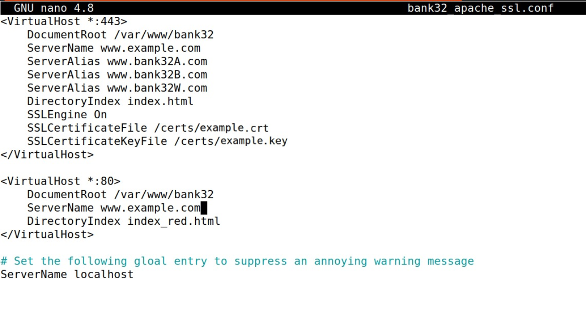

If we browse the website:

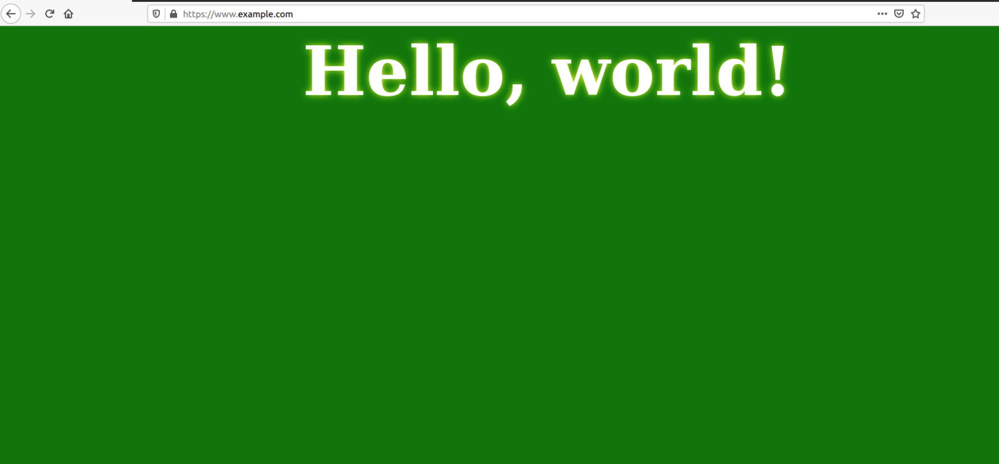

This time Firefox says that the connection is secure because our certificate is valid and signed by the CA.

Then we conclude that if the attacker has controll over the CA, he can impersonate other sites bypassing PKI.