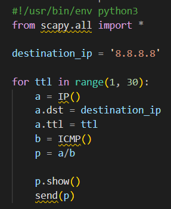
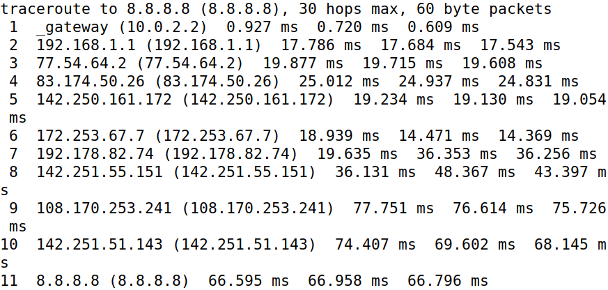
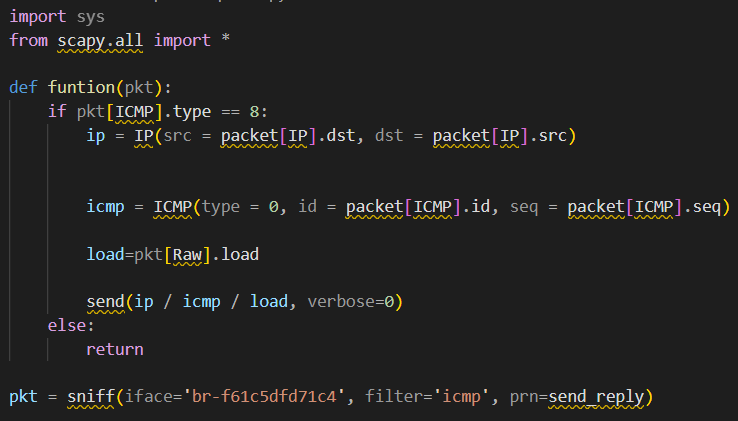
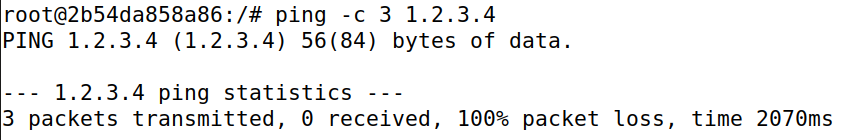
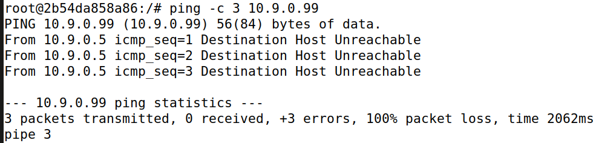
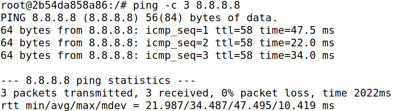

# Work from Week 13 - Sniffing and Spoofing

After configuring the containers, we executed the "ifconfig" command. Following the instructions in the guide, we searched for the assigned IP address of our virtual machine, which was specified as 10.9.0.1. We located it within the `inet`` segment of the output.


## Task 1.1: Sniffing Packets

In this task, we are asked to intercept the packets sent between two machines. To accomplish this, we use the following Python script:

```python
#!/usr/bin/env python3
from scapy.all import *

def print_pkt(pkt):
    pkt.show()

pkt = sniff(iface='br-84a837008527', filter='icmp', prn=print_pkt)
```
The `iface` is the name of the interface. We get it from the previous `ifconfig` command.

### Task 1.1A.

The assignment required us to execute the script twice: once with root privileges and once without. To facilitate this, we saved the script in a new file named "sniffer.py" and granted it executable permissions, enabling us to reuse it for both scenarios, with the command:

> chmod a+x sniffer.py

To test if we could sniff packets, we had to first send some through the network. To that end, we used the ping command.

> ping 10.9.0.6

We used it in host A to comunicate with host B.

### Results

**With Root privilege**


The packets were sniffed successfully.

**Without Root privilege**


The packets weren't sniffed, because this operation requires root privileges.

### Task 1.1B.

In this task, we are asked to capture specific packets sent between the two machines. To choose which packet we need to change the filter parameter on this line of our Pyhton code:

`pkt = sniff(iface='br-84a837008527', filter='icmp', prn=print_pkt)`

**Capture only the ICMP packet**

```python
pkt = sniff(iface='br-84a837008527', filter='icmp', prn=print_pkt)
```

**Capture any TCP packet that comes from a particular IP and with a destination port number 23**

```python
pkt = sniff(iface='br-84a837008527', filter='tcp and src host 192.168.1.100 and dst port 23', prn=print_pkt)
```

**Capture packets comes from or to go to a particular subnet**

```python
pkt = sniff(iface='br-84a837008527', filter='(net 128.230.0.0/16)', prn=print_pkt)
```

## Task 1.2: Spoofing ICMP Packets

```python
#!/usr/bin/env python3
from scapy.all import *

a = IP()
a.dst = '10.9.0.5'
b = ICMP()
p = a/b
send(p)
```
To facilitate this, we saved the script in a new file named "sniffer.py" and granted it executable permissions, as on the previous task.


FALTA ADICIONAR WIRESHARK IMAGE

## Task 1.3: Traceroute

The objective of this task is to use Scapy to estimate the distance, in terms of the number of routers, between your VM and a selected destination. This is similar to what the traceroute tool does. In this task, you will write your own tool using Scapy.


To do this, we use this code



We obtained this result



The packet passes through 11 routers until it reaches its destination


## Task 1.4: Sniffing and-then Spoofing

In this task, we need to create a program that, upon detecting an ICMP packet, forwards an ICMP echo response to the source IP address of that packet.
To do this, we use this code



We obtained this result

a) ping 1.2.3.4 



b) ping 10.9.0.99



c)ping 8.8.8.8 



In a) and b) as the hosts do not exist, the program cannot receive the packets. In c) all packets were received


