# Trabalho realizado na Semana #4 

## Task 1
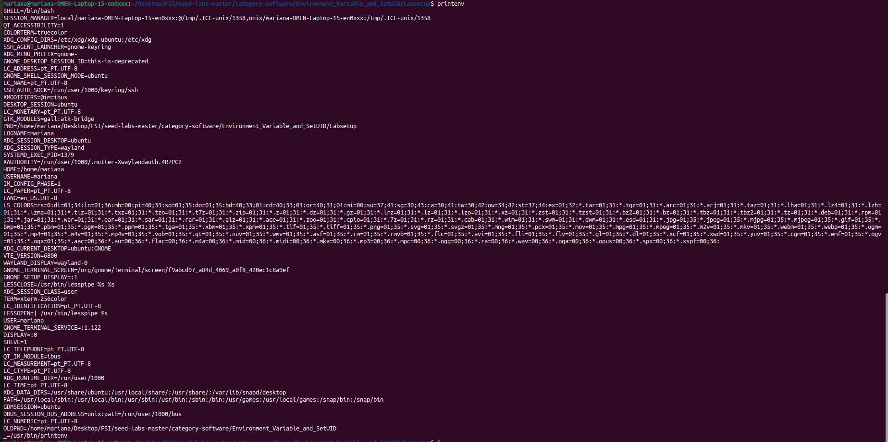

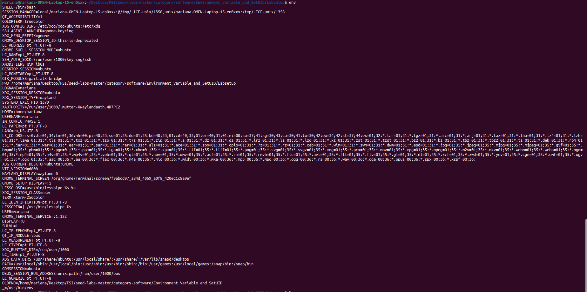

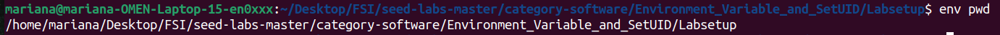

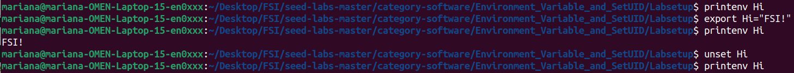

## Task 2
- Step 1:
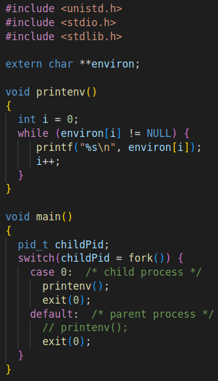
_Program_

- Step 2:
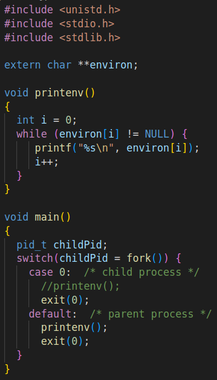
_Changed program_

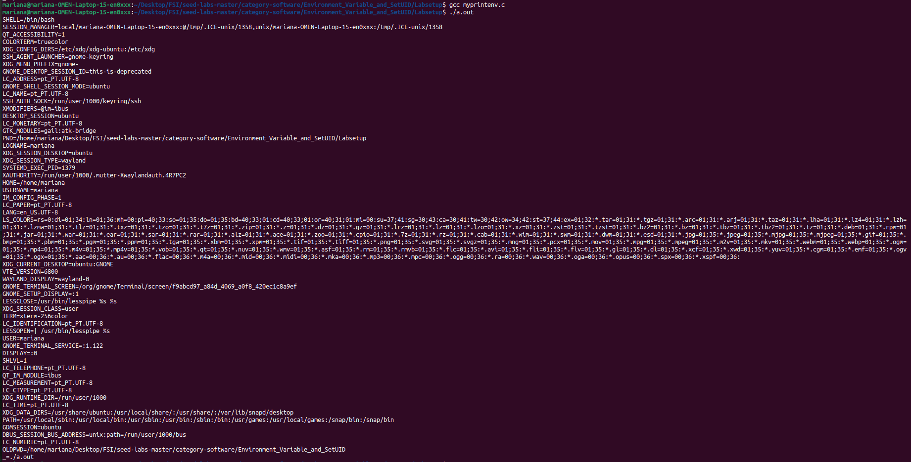

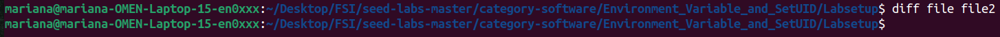

_Conclusion:_ When a fork() is made in a program, the child and the parent process have the same environment, so there’s no difference between them.

## Task 3
- Step 1:
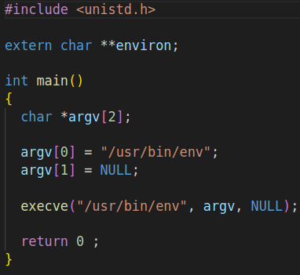
_Program_
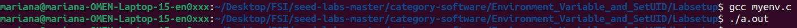

- Step 2:
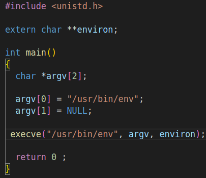

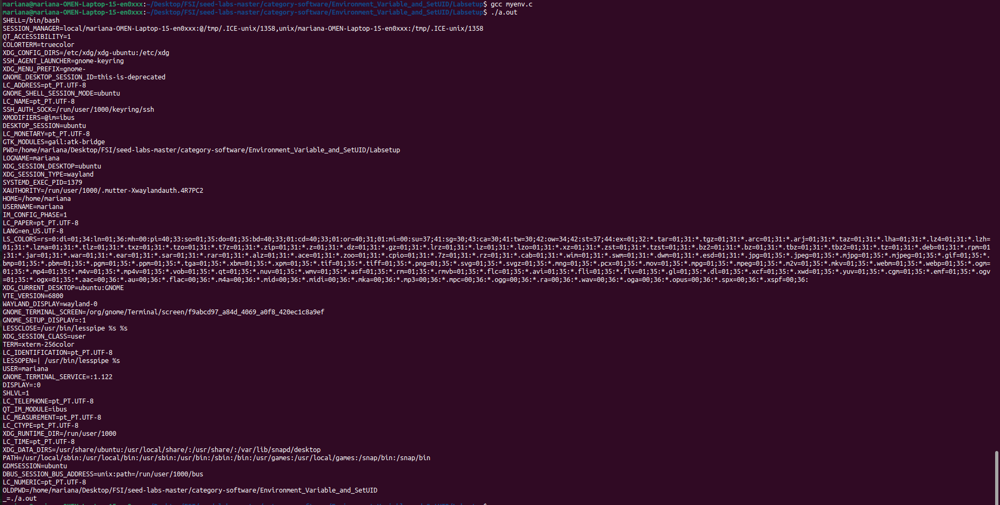

_Conclusion:_  
* If you pass `NULL` as the third argument to `execve`, the new program starts with an empty environment. 
* If you pass `environ` as the third argument to `execve`, the new program inherits the environment variables from the calling program.

## Task 4
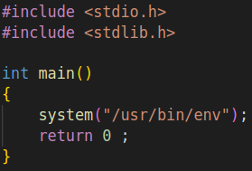
_Program_

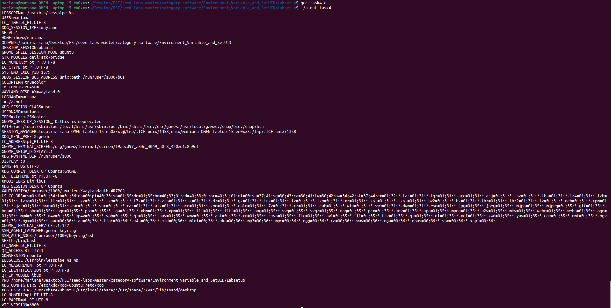

_Conclusion:_ Both execve() and system() prints on shell the environmental variables, although they don´t work the same way.
* System() creates “automatically the child process that allows it to execute the shell command.
* Execve() replaces the current process with the request command.

## Task 5
- Step 1:
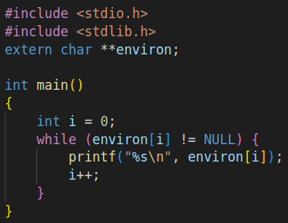
_Program_

- Step 2:
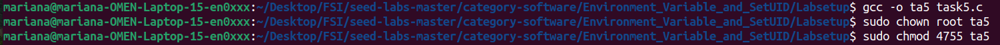

- Step 3:
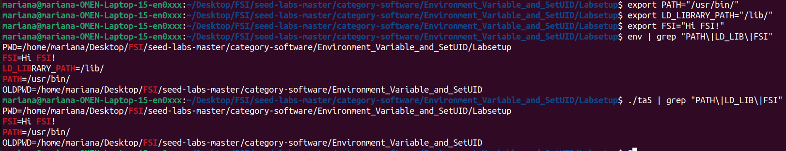

_Conlusion:_ When we run the child process the environment variable LD_LIBRARY_PATH doesn´t appear, which was a surprise

## Task 6
