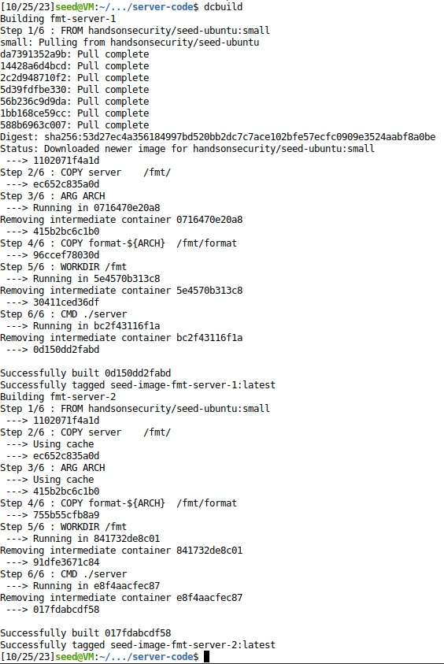
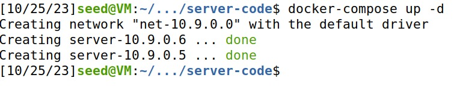
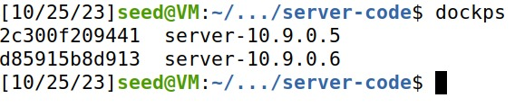
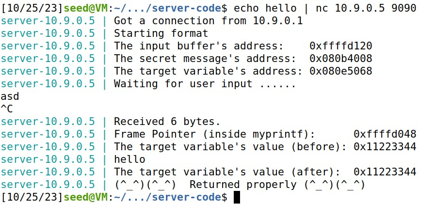
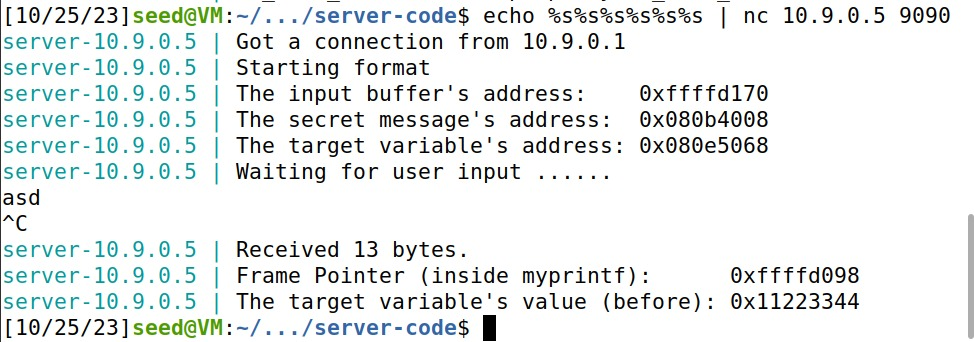

# Work from Week 5

First we ran the command `sudo sysctl -w kernel.randomize_va_space=0` to disable address space randomization, which randomizes memory addresses, making it harder for attackers to guess and exploit them. This can be useful for specific debugging or testing purposes but should be used cautiously, as it can potentially weaken the system's security.

Then we run the given server.

## Task 1

We ran `echo hello | nc 10.9.0.5 9090`, the program asked for an input that we inserted and the pressed ctrl c to finish the task.

The we ran `echo %s%s%s%s%s%s | nc 10.9.0.5 9090`, the program asked for an input that we inserted and the pressed ctrl c to finish the task. (PROGRAM CRASHED!)

## Task 2

## Task 3

