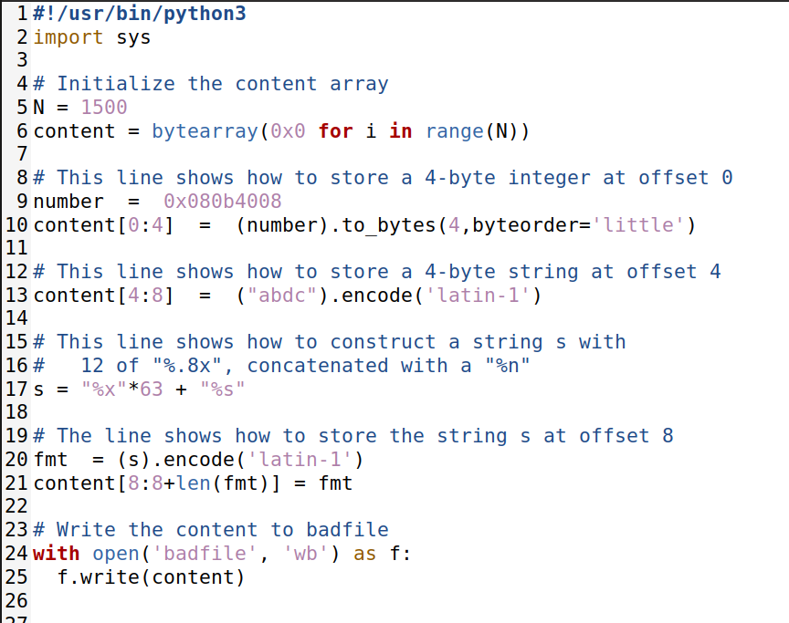

# Work from Week 7

First we ran the command `sudo sysctl -w kernel.randomize_va_space=0` to disable address space randomization, which randomizes memory addresses, making it harder for attackers to guess and exploit them. This can be useful for specific debugging or testing purposes but should be used cautiously, as it can potentially weaken the system's security.

Then we run the given server.

## Task 1

We ran `echo hello | nc 10.9.0.5 9090`, the program asked for an input that we inserted and the pressed ctrl c to finish the task.

The we ran `echo %s%s%s%s%s%s | nc 10.9.0.5 9090`, the program asked for an input that we inserted and the pressed ctrl c to finish the task. (PROGRAM CRASHED!)

## Task 2

### Task 2.A: Stack Data

We enter our input and a series of '%x' followed. To help to identifie where exactly the buffer starts we enter 4 random caracters that can be easily recognized by us, in our case we used aaaa whose hexadecimal value is 616161, that way we can find exactly the buffer size.

### Task 2.B: Heap Data

We need to print the secret message.
We changed the value of the number to the address of the secret message - 0x080b4008 - and, using the same 63 byte offset, plus the special character %s, which writes the string stored in address you are pointing to, we can write the desired message.

The secret message is A secret message.

## Task 3

### Task 3.A: Change the value to a different value

We need to change the target variable to a different value
To do that we change the target variable using 63 %x again and %n that overwites the memory.

### Task 3.B: Change the value to 0x5000

We need to change the target variable to 0x5000
To do that we need to print 20480 characthers, followed by change the target variable using 63 %x and then %n to acess and edit the value.

