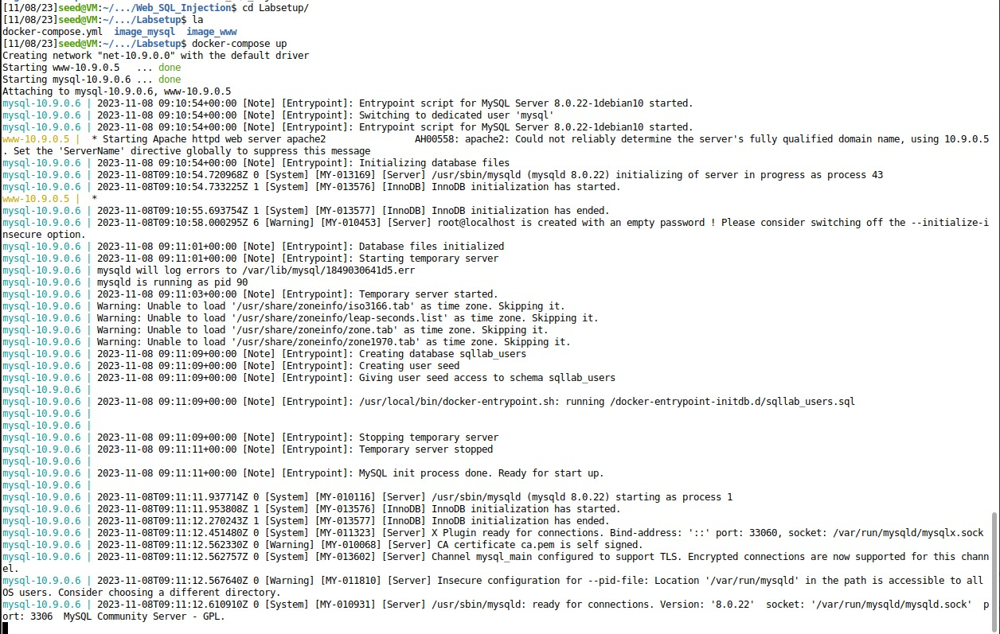
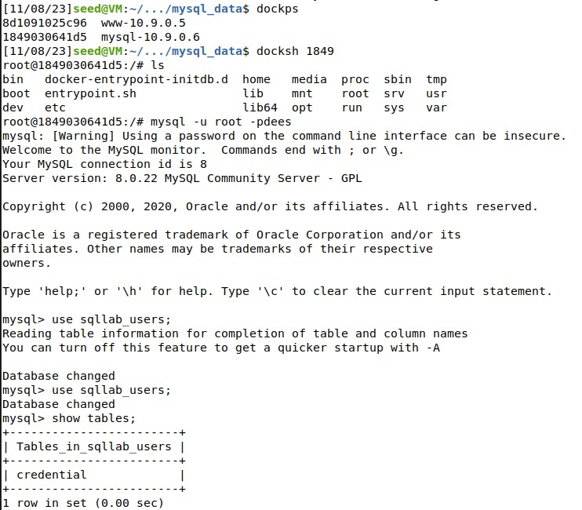
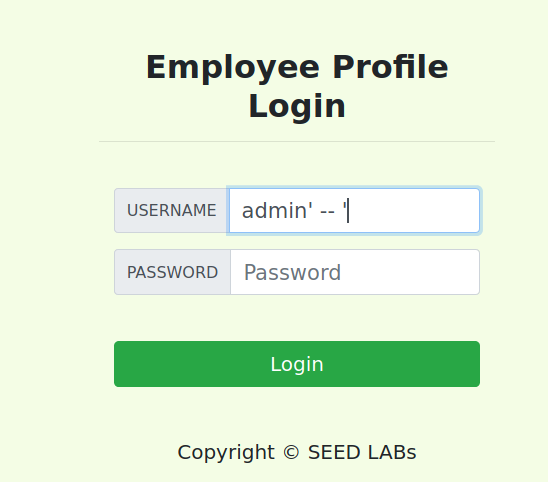
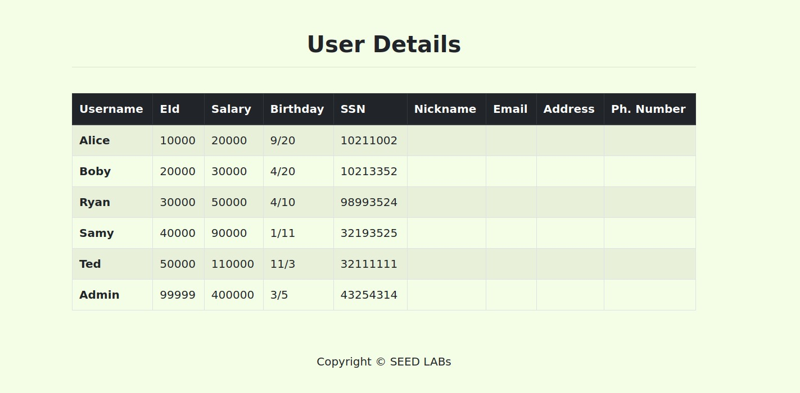
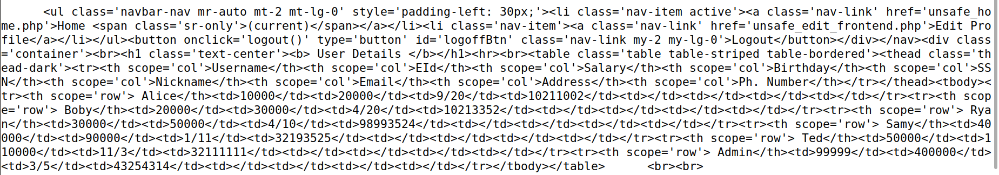
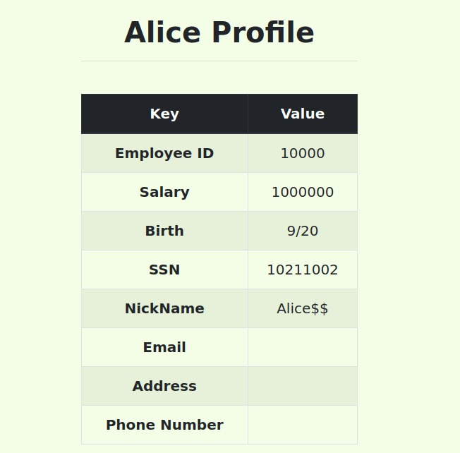
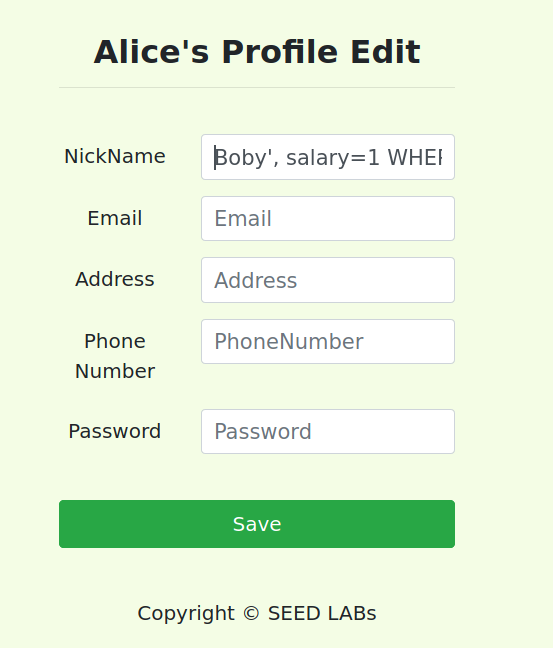
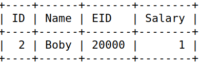
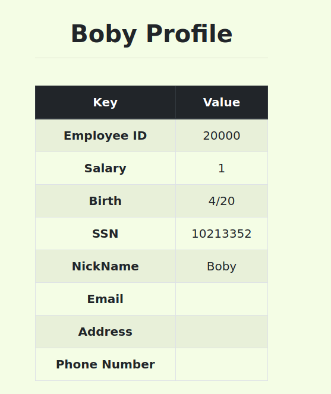

# Work from Week 8 - SQL Injection

We started by runing the docker containers.


## Task 1
The primary goal of this task was to acquaint ourselves with SQL commands through hands-on exploration of the given database.

To engage with the database, we undertook a series of steps. Initially, we accessed the shell on the MySQL container. Subsequently, we utilized the MySQL client program, employing the command "mysql -u root -pdees" to establish interaction with the database. Finally, we loaded the pre-provided database named `sqllab_users`.



Once these procedural steps were completed, we commenced our interaction with the database. A straightforward query (`select * from credential;`) was executed to retrieve the credentials table.


## Task 2
The key objective of this task is to familiarize us with the concept of a SQL injection attack, elucidating its characteristics, the types of system vulnerabilities that can facilitate its success, and the methodology involved in executing such an attack.

### Task 2.1
Our task is to log into the web application as the
administrator from the login page, so I can see the information of all the employees.

On the file unsafe_home.php this is the sql query to authenticate the user.

```
$sql = "SELECT id, name, eid, salary, birth, ssn, phoneNumber, address, email,nickname,Password
      FROM credential
      WHERE name= '$input_uname' and Password='$hashed_pwd'";
```

Instead of inserting only the username and the password we opted for this:



By entering the double dash (--), everything to the right is treated as a comment, rendering it ignored. This implies that the only constraint enforced is related to the name. By inputting the admin's name and concluding it with a single quote, the query is manipulated to fetch the admin row by name. This manipulation bypasses the password verification, enabling unauthorized access to the system under the guise of the admin.



### Task 2.2

Our task is to repeat Task 2.1, but you instead of using the the webpage we are going to use the command line.

We can initiate an HTTP request using the curl command to fetch data from the server. The URL utilized in this process incorporates query parameters where both the username and password need to be specified for user authentication. The previously mentioned logic can be applied here as well. It's important to note that special characters must be encoded, presenting the only limitation in this approach.

```
single quote(') -> %27
white space( ) -> %20
```

Changing all these characters the command should look like:

`$ curl ’www.seed-server.com/unsafe_home.php?username=admin%27%20--%20%27&Password=’`

After running these HTML code is returned (this is just a section).



Concluding we can do the same attack on the terminal and on the website. 

### Task 2.3
Our task is to use the SQL injection attack to turn one SQL statement into two, with the second one being
the update or delete statement.

In SQL, semicolon (;) is used to separate two SQL statements.

If we use as a username input `admin'; DELETE FROM credential WHERE Name= 'Alice' -- '` for example, we receive an error.

After analysing the unsafe_home.php is is possible to conclude that the the function used to make the query is `query($sql)`, and this function only sql statement. So the second one is invalidated.

## Task 3

Our task is to analyse how much damage an attack to an update statement can cause.

### Task 3.1

Alice salary is 20000, as we checked before, and our goal here is to change it.

On alice profile page if we insert `Alice', Salary = 100000 --'` on the nickname input her salary is changed.



### Task 3.2

To change other's people salary we can use the same method but with a different name.

Boby salary is 30000, as we checked before, and our goal here is to change it from Alice profile.

If we insert `Boby', Salary = 1 WHERE Name ='Boby' --'`



Then Boby's salary changes.



Concluding we could changed anything we want on the database using sql querys and the 'WHERE' statement.

### Task 3.3

Our task is to change other people's passwords.

To change Boby's password from Alice Profile page we can insert `Boby', Password=sha1('bobypassword') WHERE Name ='Boby' -- '` on the nickname, for example, using the same technique as before.

Then if we access the Boby's account with this new password:



We conclude that if we apply the method of the last task and use the respective hash function we can change other users password.
